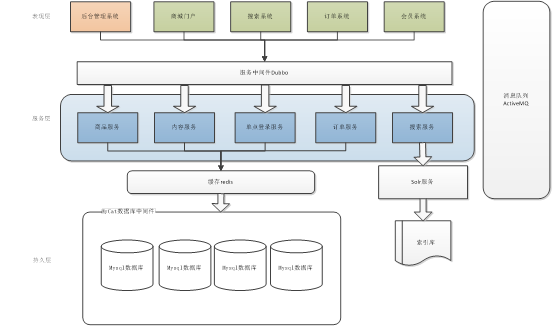
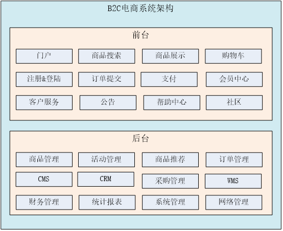

<p align="center">
  <a href="https://gitee.com/itxinfei">
    
  </a> 
  <a href="https://qm.qq.com/cgi-bin/qm/qr?k=9yLlyD1dRBL97xmBKw43zRt0-6xg8ohb&jump_from=webapi">
    
  </a> 
  <a href="http://mail.qq.com/cgi-bin/qm_share?t=qm_mailme&email=f0hLSE9OTkdHTT8ODlEcEBI">
    
  </a> 

  <a href=" ">
    
  </a> 
  <a href=" ">
    
  </a>
  <a href=" ">
    
  </a> 
</p>

#### 一、项目介绍
淘淘网上商城是一个综合性的B2C平台，类似京东商城、天猫商城。会员可以在商城浏览商品、下订单，以及参加各种活动。管理员、运营可以在平台后台管理系统中管理商品、订单、会员等。客服可以在后台管理系统中处理用户的询问以及投诉。

#### 二、项目架构
##### 1、系统架构


##### 2、功能列表


##### 3、功能描述

- 后台管理系统：管理商品、订单、类目、商品规格属性、用户管理以及内容发布等功能。
- 前台系统：用户可以在前台系统中进行注册、登录、浏览商品、首页、下单等操作。
- 会员系统：用户可以在该系统中查询已下的订单、收藏的商品、我的优惠券、团购等信息。
- 订单系统：提供下单、查询订单、修改订单状态、定时处理订单。
- 搜索系统：提供商品的搜索功能。
- 单点登录系统：为多个系统之间提供用户登录凭证以及查询登录用户的信息。

##### 4、工程结构

```
Taotao-parent：父工程，打包方式pom，管理jar包的版本号。
    |           项目中所有工程都应该继承父工程。
|--Taotao-comm：通用的工具类通用的pojo。打包方式jar
|--Taotao-manager：服务层工程。聚合工程。Pom工程
|--taotao-manager-dao：打包方式jar
|--taotao-manager-pojo：打包方式jar
|--taotao-manager-interface：打包方式jar
|--taotao-manager-service：打包方式：war
|--taotao-manager-web：表现层工程。打包方式war
```

#### 三、项目页面

##### 1、登录页面


##### 2、后台管理系统


##### 3、商品搜索页面


#### 四、涉及技术
- 缓存： redis集群
- 搜索 ：solr集群
- 模板：FreeMarker
- 数据库：mysql、mycat技术
- 视图框架：Spring MVC 4.3
- 持久层框架：MyBatis 3.3
- 核心框架：Spring Framework 4.3
- 定时器：Quartz
- 消息中间件：ActiveMQ
- 数据库连接池：Druid 1.1
- 日志管理：SLF4J 1.7、Log4j
- 服务中间件：dubbo
- 分布式管理：zookpeer
- 图片服务器：FastDFS

#### 五、项目端口

- http://localhost:8080/ taotao-manager

- http://localhost:8081/ taotao-manager-web

- http://localhost:8082/ taotao-portal-web

- http://localhost:8083/ taotao-content

- http://localhost:8084/ taotao-search-service

- http://localhost:8085/ taotao-search-web 

- http://localhost:8086/ taotao-item-web 

- http://localhost:8087/ taotao-sso-service 

- http://localhost:8088/ taotao-sso-web 

- http://localhost:8089/ taotao-cart-web

- http://localhost:8090/ taotao-order

- http://localhost:8091/ taotao-order-web

### 淘淘商城已经完结，部分技术已经过时，以后不再更新。
