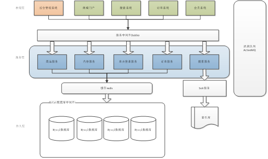
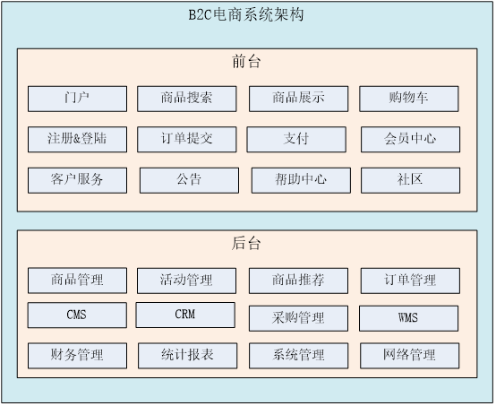

<p align="center">
  <a href="https://gitee.com/itxinfei">
    
  </a>
  <a href="https://qm.qq.com/cgi-bin/qm/qr?k=9yLlyD1dRBL97xmBKw43zRt0-6xg8ohb&jump_from=webapi">
    
  </a>
  <a href="http://mail.qq.com/cgi-bin/qm_share?t=qm_mailme&email=f0hLSE9OTkdHTT8ODlEcEBI">
    
  </a>
  <a href=" ">
    
  </a>
  <a href=" ">
    
  </a>
  <a href=" ">
    
  </a>
</p>

淘淘商城是一个基于 **Dubbo + Spring + MyBatis** 的分布式 B2C 电商平台，提供完整的商品管理、搜索、购物车、订单、单点登录等功能。适合作为 Java 分布式架构的学习案例和中小型电商项目的基础框架。

## 功能特性

- **后台管理**：商品管理、类目管理、内容发布、规格参数、订单处理
- **门户网站**：首页展示、商品检索、商品详情、购物车、下单结算
- **单点登录**：跨系统登录态管理
- **搜索服务**：基于 Solr 的商品全文检索
- **内容管理**：广告位、分类内容的动态发布

## 系统架构





## 技术栈

| 技术 | 用途 |
|------|------|
| Spring Framework 4.2.4 | 核心框架 |
| Spring MVC 4.2.4 | Web MVC 框架 |
| MyBatis 3.2.8 | 持久层框架 |
| Dubbo 2.5.3 | 分布式服务治理 |
| ZooKeeper 3.4.7 | 服务注册与发现 |
| Redis 3.0+ | 分布式缓存 |
| Solr 4.10.3 | 全文搜索引擎 |
| ActiveMQ 5.11.2 | 消息中间件 |
| FastDFS 5.0+ | 分布式文件存储 |
| FreeMarker 2.3.23 | 页面静态化 |
| Druid 1.0.9 | 数据库连接池 |
| Quartz 2.2.2 | 任务调度 |
| SLF4J + Log4j | 日志框架 |

## 快速开始

### 环境准备

**必装软件：**
- JDK 1.7+（推荐 JDK 1.8）
- Maven 3.2+
- MySQL 5.7+
- Tomcat 7.0+

**可选中间件（根据需要安装）：**
- Redis 3.0+（缓存服务）
- ZooKeeper 3.4+（Dubbo注册中心）
- Solr 4.10+（搜索服务）
- ActiveMQ 5.11+（消息队列）
- FastDFS 5.0+（文件存储）

### 第一步：初始化数据库

```bash
# 1. 创建数据库
mysql -u root -p -e "CREATE DATABASE taotao CHARACTER SET utf8 COLLATE utf8_general_ci;"

# 2. 导入SQL脚本
mysql -u root -p taotao < Doc/taotao.sql
```

### 第二步：配置数据源

编辑各 service 模块下的 `src/main/resources/properties/db.properties`：

```properties
jdbc.driver=com.mysql.jdbc.Driver
jdbc.url=jdbc:mysql://localhost:3306/taotao?characterEncoding=utf-8
jdbc.username=root
jdbc.password=your_password
```

### 第三步：编译项目

```bash
# 进入项目目录
cd taotao-parent

# 先安装父POM到本地仓库
mvn install -N

# 编译所有模块（跳过测试）
mvn clean install -DskipTests
```

### 第四步：部署运行

#### 方式一：使用 Maven Tomcat 插件运行（推荐）

```bash
# 启动后台管理服务（端口8083）
cd taotao-manager/taotao-manager-service
mvn tomcat7:run

# 启动后台管理Web（端口8081）
cd taotao-manager-web
mvn tomcat7:run

# 启动门户网站（端口8082）
cd taotao-portal-web
mvn tomcat7:run
```

#### 方式二：部署到独立 Tomcat

1. 将各模块的 `target/*.war` 文件复制到 Tomcat 的 `webapps` 目录
2. 按依赖顺序启动各服务

### 启动顺序（分布式模式）

淘淘商城采用 Dubbo 分布式架构，服务之间存在依赖关系：

| 顺序 | 模块 | 端口 | 说明 |
|------|------|------|------|
| 1 | taotao-manager-service | 8083 | Dubbo服务提供者 |
| 2 | taotao-content-service | 8080 | 内容服务 |
| 3 | taotao-search-service | 8084 | 搜索服务 |
| 4 | taotao-sso-service | 8087 | 单点登录服务 |
| 5 | taotao-order-service | 8090 | 订单服务 |
| 6 | taotao-manager-web | 8081 | 后台管理 |
| 7 | taotao-portal-web | 8082 | 门户网站 |
| 8 | taotao-search-web | 8085 | 搜索前端 |
| 9 | taotao-item-web | 8086 | 商品详情 |
| 10 | taotao-sso-web | 8088 | SSO前端 |
| 11 | taotao-cart-web | 8089 | 购物车 |
| 12 | taotao-order-web | 8091 | 订单前端 |

## 项目结构

```
taotao-parent
├── taotao-common               # 通用工具类、POJO
├── taotao-manager/             # 后台管理服务层
│   ├── taotao-manager-dao      # 数据访问层
│   ├── taotao-manager-pojo     # POJO类
│   ├── taotao-manager-interface # Dubbo接口
│   └── taotao-manager-service  # Dubbo服务实现
├── taotao-manager-web          # 后台管理Web
├── taotao-portal-web           # 门户网站
├── taotao-content/             # 内容服务
│   ├── taotao-content-interface
│   └── taotao-content-service
├── taotao-search/              # 搜索服务
│   ├── taotao-search-interface
│   └── taotao-search-service
├── taotao-search-web           # 搜索前端
├── taotao-item-web             # 商品详情页
├── taotao-sso/                 # 单点登录服务
│   ├── taotao-sso-interface
│   └── taotao-sso-service
├── taotao-sso-web              # SSO前端
├── taotao-cart-web             # 购物车
├── taotao-order/               # 订单服务
│   ├── taotao-order-interface
│   └── taotao-order-service
└── taotao-order-web            # 订单前端
```

## 访问地址

| 模块 | 地址 |
|------|------|
| 后台管理 | http://localhost:8081 |
| 门户网站 | http://localhost:8082 |
| 搜索页面 | http://localhost:8085 |
| 商品详情 | http://localhost:8086 |
| SSO登录 | http://localhost:8088 |
| 购物车 | http://localhost:8089 |

## 配置说明

### 外部服务配置

各模块的 `resource.properties` 配置文件中包含外部服务地址：

**Redis配置**（applicationContext-jedis.xml）：
- 默认地址：`172.168.20.221:6379`
- 修改位置：各 service 模块下的 `spring/applicationContext-jedis.xml`

**ZooKeeper配置**（springmvc.xml / applicationContext-service.xml）：
- 默认地址：`172.168.20.221:2181`
- 修改位置：各 web/service 模块下的 spring 配置文件

**Solr配置**（applicationContext-solr.xml）：
- 默认地址：`http://172.168.20.221:8983/solr/collection1`
- 修改位置：taotao-search-service 模块

**ActiveMQ配置**（applicationContext-activemq.xml）：
- 默认地址：`tcp://172.168.20.221:61616`
- 修改位置：taotao-manager-service、taotao-search-service 模块

### 本地开发环境配置

如果在本地开发环境运行（无外部服务），建议：

1. **使用本地Redis**：修改 `applicationContext-jedis.xml` 中的主机为 `localhost`
2. **使用本地ZooKeeper**：修改各配置文件中的主机为 `localhost`
3. **使用本地Solr**：修改 `applicationContext-solr.xml` 中的地址
4. **使用本地ActiveMQ**：修改 `applicationContext-activemq.xml` 中的地址

## 常见问题

### 问题1：Maven编译失败

**原因**：依赖下载失败或版本冲突

**解决方案**：
```bash
# 清理Maven缓存
mvn clean install -U -DskipTests

# 或手动删除本地仓库中的相关依赖后重新编译
```

### 问题2：服务无法启动

**原因**：端口被占用或外部服务未启动

**解决方案**：
```bash
# 检查端口占用
netstat -ano | findstr :8081

# 启动外部服务
# Redis: redis-server
# ZooKeeper: zkServer.sh start
# Solr: solr start
# ActiveMQ: activemq start
```

### 问题3：数据库连接失败

**原因**：数据库配置错误或MySQL服务未启动

**解决方案**：
```bash
# 检查MySQL服务
net start mysql

# 验证数据库连接
mysql -u root -p taotao
```

## 界面预览

| 页面 | 截图 |
|------|------|
| 登录页面 |  |
| 后台管理 |  |
| 商品搜索 |  |

## 贡献

欢迎提交 Issue 和 Pull Request！请阅读 [CONTRIBUTING.md](CONTRIBUTING.md)。

## 许可证

本项目基于 Apache License 2.0 开源，详见 [LICENSE](LICENSE)。

- http://localhost:8082/ taotao-portal-web
- http://localhost:8083/ taotao-content
- http://localhost:8084/ taotao-search-service
- http://localhost:8085/ taotao-search-web 
- http://localhost:8086/ taotao-item-web 
- http://localhost:8087/ taotao-sso-service 
- http://localhost:8088/ taotao-sso-web 
- http://localhost:8089/ taotao-cart-web
- http://localhost:8090/ taotao-order
- http://localhost:8091/ taotao-order-web

> 淘淘商城已完结，部分技术可能已过时，适合作为学习和参考项目。
